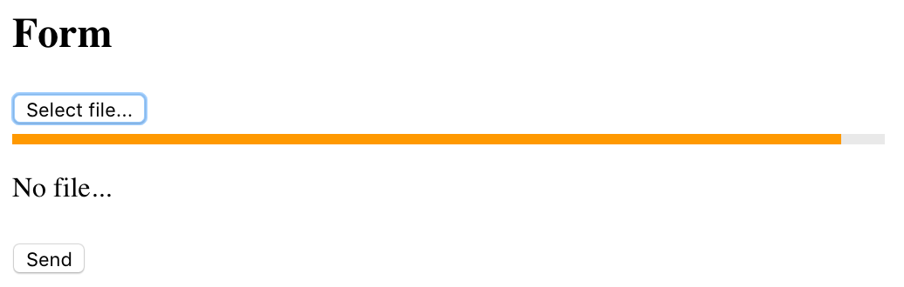
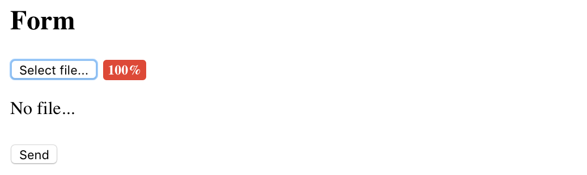
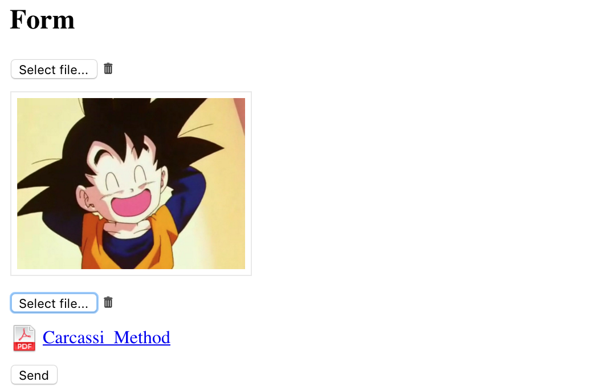
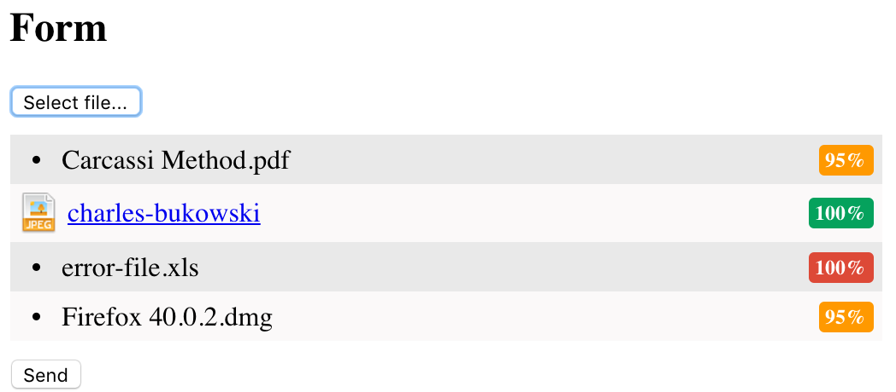

# Angular Upload

This library is a directive that wraps the following:

* [Angular-Pallet](https://github.com/platanus/angular-pallet/blob/v2.0.0/README.md): it's an angular directive to perform asynchronous file uploads. It's built on top of [Ng-File-Upload](https://github.com/danialfarid/ng-file-upload) and it was created to play with [Paperclip Upload](https://github.com/platanus/paperclip_upload) gem.

* [Angular-Progress](https://github.com/platanus/angular-progress): directive that allows you to show progress status as a bar or percentage badge.

* [Angular-Doc-Preview](https://github.com/platanus/angular-doc-preview): directive that allows you to show a file preview from a given url.

This directive is not intended to be a replacement for [Ng-File-Upload](https://github.com/danialfarid/ng-file-upload). Rather, it uses its potential and prevents you to deal with annoying details like:

*The visual representation of the upload progress.*



*The visual representation of errors in the upload process.*



*The file preview. Not only images, files of any kind.*



*The visual representation of the multiple files to upload.*



As "the icing on the cake", it handles the upload process asynchronously using the [angular-pallet](https://github.com/platanus/angular-pallet/blob/v2.0.0/README.md) directive.

## Installation

```bash
bower install ng-file-upload --save
bower install https://github.com/platanus/angular-upload --save
```

Include the JS files in your project and the library as an Angular Dependency

```javascript
angular.module('yourapp', ['platanus.upload']);
```

> The library comes with a proposed stylesheet under `/dist/angular-upload.css`. You can use it or
> create your own.

## Usage

To make it simple, I'm going to show you a use case example...
Suppose you have a `User` model. This model has two attributes: `avatar` (user photo) and `file` (a document or spreadsheet). So, from your application, you want to let the user:

1. Upload the avatar. See a preview (a thumbnail maybe), be sure the upload was successful.
2. Upload the  file. See a preview (a link), be sure the upload was successful.
3. Submit the form and link all the user data on the server.

```html
<form method="post" action="/users">

  <async-upload-preview
    render-image-as="thumb"
    no-document-text="No avatar..."
    upload-url="uploads"
    ng-model="user.avatarIdentifier">
  </async-upload-preview>

  <async-upload-preview
    no-document-text="No file..."
    upload-url="uploads"
    ng-model="user.fileUrl">
  </async-upload-preview>

  <input type="hidden" ng-value="user.avatarIdentifier" name="user[avatar_identifier]" />
  <input type="hidden" ng-value="user.fileIdentifier" name="user[file_identifier]" />

  <input type="submit" value="Send" />

</form>
```


In order to make this directive work, the `POST /uploads` response must be a json with the following format:

```json
{
  "upload": {
    "identifier": "RmQwYe5j",
    "file_extension": "png",
    "file_name": "pikachu",
    "download_url": "http://server.platan.us/uploads/RmQwYe5j/download"
  }
}
```
> [Paperclip Upload](https://github.com/platanus/paperclip_upload) solves the server side for you.

#### Directive Options:

##### Mandatory

- *ng-model:* to keep the identifier(s) of the uploaded file. If *multiple* attribute is "true", the model will have a value like this: `["EJ6pOl5Y", "ZN5BaK3j"]` otherwise `"EJ6pOl5Y"`.
- *upload-url:* must contain the url to perform the `POST` to save files.

##### Optional

- *no-document-text:* custom message to show when the url is empty. By default, will show nothing.
- *render-image-as:* this option is only for images. You can choose, to show images: as `link` or `thumb`. If this attribute is not present will show thumbnail and link.
- *progress-type:* with `"bar"` value, will show a progress bar. With `indicator` value will show a progress badge with this format `{progress}%` (for example 35%). Default is `indicator`.
- *multiple:* if present, multiple upload functionality will be enabled.

## Contributing

1. Fork it
2. Create your feature branch (`git checkout -b my-new-feature`)
3. Commit your changes (`git commit -am 'Add some feature'`)
4. Push to the branch (`git push origin my-new-feature`)
5. Create new Pull Request

## Credits

Thank you [contributors](https://github.com/platanus/angular-upload/graphs/contributors)!


angular-upload is maintained by [platanus](http://platan.us).

## License

angular-upload is © 2015 platanus, spa. It is free software and may be redistributed under the terms specified in the LICENSE file.
