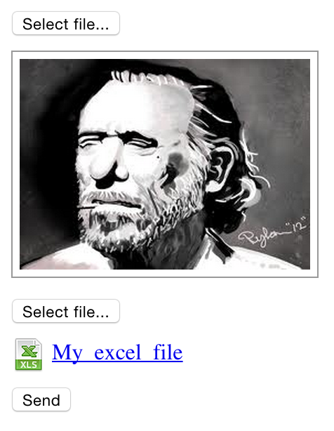

# Angular Upload

It's a library with a set of directives created to play with [Paperclip Upload](https://github.com/platanus/paperclip_upload) gem.

> It's not mandatory to use Rails and Paperclip Upload. You can always mimic the server functionality.

## Installation

```bash
bower install ng-file-upload --save
bower install https://github.com/platanus/angular-upload --save
```

Include the JS files in your project and the library as an Angular Dependency

```javascript
angular.module('yourapp', ['platanus.upload']);
```

> The library comes with a proposed stylesheet under `/dist/angular-upload.css`. You can use it or
> create your own.

## Usage

To make it simple, I'm going to give a use case example...
Suppose you have a `User` model. This model has two attributes: `avatar` (user photo) and `file (a document or spreadsheet). Now suppose, from your application, you want to:

1. Upload the user's avatar. See a preview (a thumbnail maybe), be sure the upload was successful.
2. Upload the user's file. See a preview (a link), be sure the upload was successful.
3. Save the user data.

In short, you want to make different requests to upload avatar and file attributes and then save the user with all the data in a lighter request.

**The advantages of doing this are:**

- You can have feedback after each file is saved.
- You can send to the server all the files you want. The final request (when you save the user), will have references to saved resources not the files themselves, making the request lighter.

So, to achieve this, we can use a few directives I will show next:

### Async Upload Directive

This directive allows you to perform a `POST` to a given endpoint (`/uploads` on this example) with a file. The url, must return a file identifier. This identifier (that represents the uploaded file), will be stored inside an attribute (`user.avatarIdentifier` or `user.fileIdentifier`) passed to the `ng-model`.

#### Example

```html
<async-upload
  upload-url="uploads"
  button-label="Select Avatar..."
  ng-model="user.avatarIdentifier">
</async-upload>

<async-upload
  upload-url="api/uploads"
  start-callback="startCallback()"
  success-callback="successCallback(uploadData)"
  progress-callback="progressCallback(event)"
  error-callback="errorCallback(errorData)"
  ng-model="user.fileIdentifier">
</async-upload>
```

In order to work the `POST /uploads` response must be a json with the following format:

```json
{
  "upload": {
    "identifier": "some hash",
  }
}
```
> [Paperclip Upload](https://github.com/platanus/paperclip_upload) solves the server side for you.

#### Directive Options:

##### Mandatory

- *ng-model:* to keep the identifier of the uploaded file.
- *upload-url:* must contain the url to perform the `POST` to save files.

##### Optional

- *button-label:* you can pass this key as an HTML attribute to customize the upload button label. "Select File..." is the default value.
- *start-callback:* to perform your own operations when upload process begins.
- *success-callback:* to perform your own operations after a successful upload.
- *progress-callback:* it gives you information about upload progress.
- *error-callback:* to perform operations after a failed upload.

### Doc Preview Directive

This directive allows you to show a file preview from a given url.
By default, will try to infer the file type from the url. For example, if `user.fileUrl` has the value: `http://server.platan.us/files/my-file.xls?1435170296`, the directive will notice the url represents an Excel file and will show a link with an "Excel icon". If, for example, `user.fileUrl` contains `http://server.platan.us/files/my-smiley-face.png` then, by default, will show a thumbnail with a link.

#### Example

```html
<doc-preview
  render-image-as="thumb"
  document-extension="png"
  document-name="user.avatarName"
  document-url="user.avatarUrl">
</doc-preview>

<doc-preview
  document-url="user.fileUrl">
</doc-preview>
```

#### Directive Options:

##### Mandatory

- *document-url:* the url containing the image to show.

##### Optional

- *document-name:* set this value if you want a custom text for the resultant link. By default, will show the url.
- *document-extension:* sometimes, the url does not have information about the file type (for example: `http://server.platan.us/users/9/download`). But, if you know the url file type you can pass it as option.
- *no-document-text:* custom message to show when the url is empty. By default, will show nothing.
- *render-image-as:* this option is only for images. You can choose, to show images: as `link` or `thumb`. If this attribute is not present will show thumbnail and link.

### Upload Progress

Directive to show the upload progress as percentage value.

#### Example

```html
<upload-progress
  hide-on-zero="true"
  progress-data="progressData">
</upload-progress>
```

#### Directive Options:

##### Mandatory

- *progress-data:* must be a json with the following structure: `{ loaded: XXX, total: XXX }`. `total` value represents the total file size. `loaded` represents bytes loaded at a given time.

##### Optional

- *hide-on-zero:* if present, the directive will be hidden whith progress value equals to 0%.

### Async Upload Preview Directive

This directive wraps the previous. `asyncUpload` saves the file and passes the response to `docPreview` to show a preview of the loaded file.

#### Example

```html
<async-upload-preview
  render-image-as="thumb"
  no-document-text="No avatar..."
  upload-url="uploads"
  ng-model="user.avatarIdentifier">
</async-upload-preview>

<async-upload-preview
  no-document-text="No file..."
  upload-url="uploads"
  ng-model="user.fileUrl">
</async-upload-preview>
```

In order to make this directive work, the `POST /uploads` response must be a json with the following format:

```json
{
  "upload": {
    "identifier": "RmQwYe5j",
    "file_extension": "png",
    "file_name": "pikachu",
    "download_url": "http://server.platan.us/uploads/RmQwYe5j/download"
  }
}
```
> [Paperclip Upload](https://github.com/platanus/paperclip_upload) solves the server side for you.

#### Directive Options:

##### Mandatory

- *ng-model:* same as `ng-model` on `asyncUpload` directive.
- *upload-url:* same as `upload-url` on `asyncUpload` directive.

##### Optional

- *no-document-text:* same as `no-document-text` on `docPreview` directive.
- *render-image-as:* same as `render-image-as` on `docPreview` directive.

## Use Case Example

So, to satisfy the use case, We can have a form like this:

```html
<form method="post" action="/users">

  <async-upload-preview
    render-image-as="thumb"
    no-document-text="No avatar..."
    upload-url="uploads"
    ng-model="user.avatarIdentifier">
  </async-upload-preview>

  <async-upload-preview
    no-document-text="No file..."
    upload-url="uploads"
    ng-model="user.fileUrl">
  </async-upload-preview>

  <input type="hidden" ng-value="user.avatarIdentifier" name="user[avatar_identifier]" />
  <input type="hidden" ng-value="user.fileIdentifier" name="user[file_identifier]" />

  <input type="submit" value="Send" />

</form>
```



## Contributing

1. Fork it
2. Create your feature branch (`git checkout -b my-new-feature`)
3. Commit your changes (`git commit -am 'Add some feature'`)
4. Push to the branch (`git push origin my-new-feature`)
5. Create new Pull Request

## Credits

Thank you [contributors](https://github.com/platanus/angular-upload/graphs/contributors)!


angular-upload is maintained by [platanus](http://platan.us).

## License

angular-upload is © 2015 platanus, spa. It is free software and may be redistributed under the terms specified in the LICENSE file.
